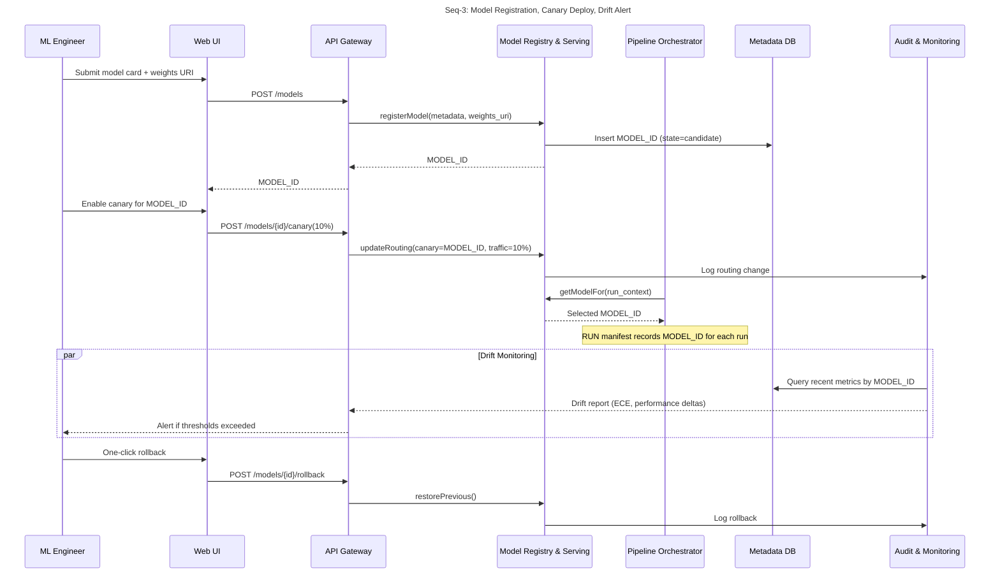

# Design: Sequence Diagrams

## Seq-1: Case Upload, Pipeline Run, Provenance (S01, S17)

```mermaid
sequenceDiagram
title Seq-1: Case Upload, Pipeline Run, Provenance
participant VR as Vision Researcher
participant UI as Web UI
participant SSO as SSO/IdP
participant API as API Gateway
participant PIPE as Pipeline Orchestrator
participant ENG as Analytics Engine
participant MR as Model Registry & Serving
participant MDB as Metadata DB
participant OBJ as Object Storage
participant AUD as Audit & Monitoring

VR->>UI: Login + upload AO-OCT volume
UI->>SSO: Auth request (OIDC/SAML)
SSO-->>UI: ID/access token
UI->>API: POST /cases (token, metadata, de-id)
API->>MDB: Insert CASE_ID
API-->>UI: 201 CASE_ID

UI->>API: POST /runs (CASE_ID, params, idempotency_key)
API->>PIPE: createRun(CASE_ID, params, idem_key)
PIPE->>MDB: Insert RUN_ID (QUEUED)
PIPE-->>API: RUN_ID
API-->>UI: 202 RUN_ID

PIPE->>OBJ: Store raw volume
PIPE->>MR: Get model(version)
MR-->>PIPE: MODEL_ID
PIPE->>ENG: startProcessing(RUN_ID, CASE_ID, MODEL_ID)
ENG->>OBJ: Read inputs
ENG->>ENG: Preproc, register, segment, quantify
ENG->>OBJ: Write masks, overlays, metrics
ENG->>OBJ: Write RUN manifest (immutable)
ENG->>MDB: Update RUN (SUCCEEDED, manifest_uri, metrics)
ENG->>AUD: Emit logs/traces

note over PIPE,ENG: On timeout/error, PIPE retries; idempotency_key prevents duplicate RUNs

VR->>UI: GET /runs/{RUN_ID}
UI->>API: Fetch status + artifacts
API->>MDB: Read RUN + manifest
API-->>UI: State + links
```

## Seq-2: Mask Edit, Versioning, Adjudication (S05, S16)

```mermaid
sequenceDiagram
title Seq-2: Mask Edit, Versioning, Adjudication
participant LB as Labeler / Adjudicator
participant UI as Web UI
participant API as API Gateway
participant MDB as Metadata DB
participant OBJ as Object Storage
participant AUD as Audit & Monitoring

LB->>UI: Open case (SSO-authenticated)
UI->>API: GET /labels?CASE_ID
API->>MDB: Fetch LABEL versions
API-->>UI: Label list + URIs

LB->>UI: Edit mask
UI->>API: POST /labels (CASE_ID, RUN_ID, diff, parent_LABEL_ID)
API->>OBJ: Store new mask blob (LABEL_ID_vN)
API->>MDB: Insert LABEL row (rater_id, parent, ts)
API->>AUD: Log label change

opt Adjudication
  LB->>UI: Open adjudication view
  UI->>API: GET /labels/conflicts?CASE_ID
  API->>MDB: Fetch conflicting LABELs
  LB->>UI: Submit consensus
  UI->>API: POST /labels (type=CONSENSUS, sources=[IDs])
  API->>OBJ: Store consensus mask
  API->>MDB: Link consensus + provenance
  API->>AUD: Log adjudication decision
end

note over API,MDB: Rollback = switch active pointer to prior LABEL_ID; history immutable
```

## Seq-3: Model Registration, Canary, Drift Alert (S07, S08, S13)


